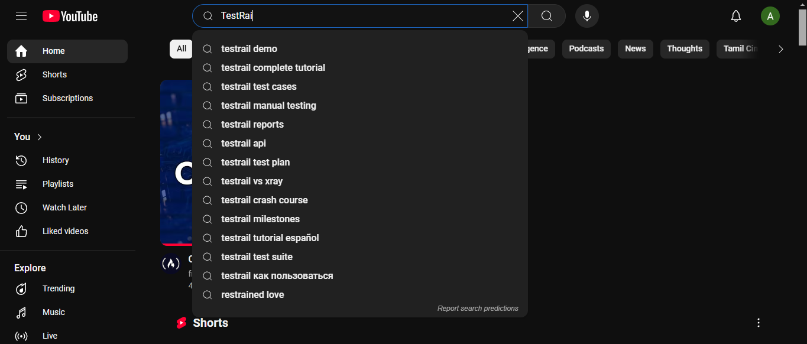
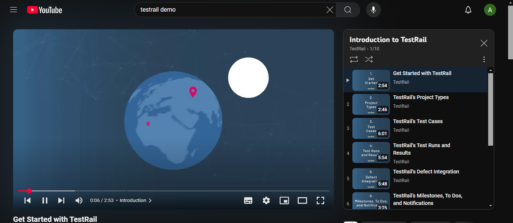
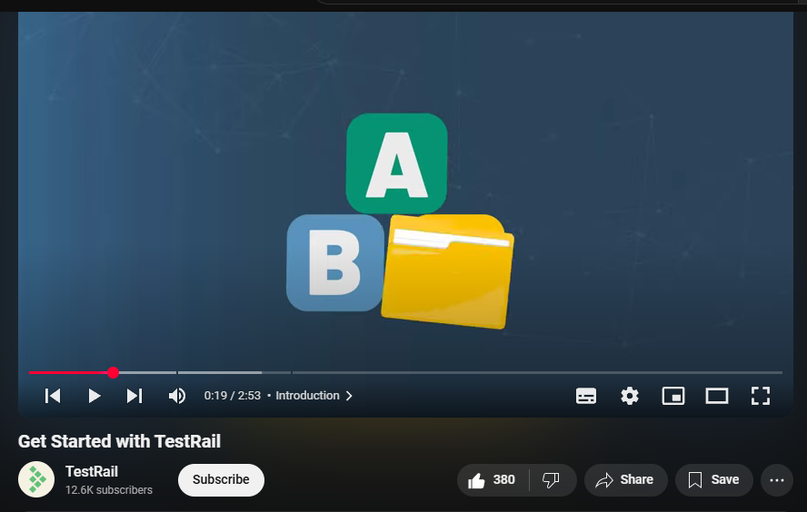

# 🎯 YouTube Testing Project  

## 📌 Project Overview  
This project contains **manual test cases and execution results** for testing **YouTube Video Playback & Comments**. The goal was to validate **search functionality, video playback, likes, and commenting features** on YouTube.  

---

## 📊 Test Summary  
✅ **Total Test Cases:** 4  
✅ **Passed:** 4  
❌ **Failed:** 0  

---

## 📸 Screenshots  
  
  
  

---

## 📜 Tools Used  
- ✅ **Manual Testing**  
- ✅ **Google Chrome** (Testing environment)  

---

## 📌 How to Use This Repository  
1️⃣ Review the **test cases** in [`YouTube_TestCases.md`](YouTube_TestCases.md).  
2️⃣ View **screenshots** of the execution in the `screenshots/` folder.  

---

## 🔗 Website Tested  
📌 **Live Website:** [YouTube](https://www.youtube.com/)  

---

### 👨‍💻 Author  
🔹 **Aditya Kannur**  
🔹 **GitHub:** [https://github.com/aditya-kannur](#)  

---
